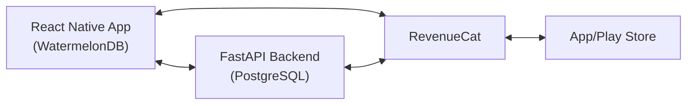

# Turn Pro Poker - Implementation Plan

> **Status as of Feb 9, 2026**  
> Phase 2 complete. Backend deployed to Render, sync working successfully. Ready for RevenueCat configuration.

---

## Quick Status

### ✅ Completed
- Backend API (FastAPI + PostgreSQL)
- **Backend deployed to Render** (`https://turn-pro-poker-api.onrender.com`)
- Authentication (JWT)
- WatermelonDB models and sync endpoints
- Sync infrastructure (`SyncContext.tsx`, `SyncIndicator.tsx`)
- All core screens (Dashboard, Sessions, Stats, Bankroll, Hands, Settings)
- Android development build
- Basic tests (11/11 frontend, 5/5 backend passing)

### 🚧 In Progress
- RevenueCat configuration (Phase 3)

### ⏳ Upcoming
- iOS build
- UI polish (glassmorphism, privacy mode, export features)
- Comprehensive testing
- App Store submission

---

## Architecture



**Tech Stack:**
- Mobile: React Native + Expo + WatermelonDB
- Backend: FastAPI + PostgreSQL + JWT
- Payments: RevenueCat
- Hosting: Render.com (planned)

---

## Current Priority: RevenueCat Configuration (Phase 3)

**Why:** Sync is complete, now need to set up in-app purchases

**Steps:**
1. Create RevenueCat account
2. Configure API keys in app
3. Define subscription products (Free/Premium/Pro)
4. Build paywall screen UI
5. Test with sandbox accounts (iOS + Android)
6. Set up backend webhook handler

**ETA:** 3-4 days

---

## Timeline to Launch

| Phase | Est. Duration | Status |
|-------|--------------|---------|
| Backend Deployment | 2-3 days | ⏳ Next |
| Server Sync | 3-5 days | ⏳ Pending |
| RevenueCat Setup | 3-4 days | ⏳ Pending |
| iOS Build | 2-3 days | 🔜 Soon |
| UI Polish | 1-2 weeks | 🔜 Soon |
| Testing | 1 week | 🔜 Soon |
| Store Submission | 1 week | 🔜 Soon |

**Total: 6-8 weeks to launch**

---

## User Review Required

> [!IMPORTANT]
> **Technology Decisions:**
> - ✅ WatermelonDB for offline-first (APPROVED - implemented)
> - ✅ RevenueCat for IAP (APPROVED - SDK integrated)
> - ✅ Expo Development Build (APPROVED - Android working)

> [!WARNING]  
> **Breaking Changes:**
> - ✅ Expo Go replaced with development builds (COMPLETE)
> - ⚠️ Requires Xcode for iOS builds (upcoming)

---

## Verification Plan

### Backend Tests
```bash
cd backend && pytest --cov=app
# Current: ~60% | Target: >80%
```

### Frontend Tests
```bash
cd frontend && npm test -- --coverage
# Current: 11/11 passing ✅
```

### Manual Testing
- [x] Offline session creation works
- [x] WatermelonDB queries functional
- [x] Auth flow (register/login) works
- [ ] Server sync (pending deployment)
- [ ] RevenueCat purchases (pending config)
- [ ] iOS build (pending)

---

## Key Files

**Backend:**
- `backend/app/api/v1/endpoints/sync.py` - Sync endpoints ✅
- `backend/app/api/v1/endpoints/auth.py` - Authentication ✅
- `backend/app/api/v1/endpoints/webhooks.py` - RevenueCat handler ⏳

**Frontend:**
- `frontend/model/Session.ts` - WatermelonDB Session model ✅
- `frontend/sync/index.ts` - Sync adapter ⏳
- `frontend/services/purchases.ts` - RevenueCat wrapper ✅
- `frontend/app/(tabs)/` - Main screens ✅

---

## Next 3 Steps

1. **Deploy Backend** (this week)
2. **Test Server Sync** (next week)  
3. **Configure RevenueCat** (next week)

**For detailed documentation, see:** [Next Phase.md](file:///c:/Users/USER/Desktop/Turn-Pro-Poker/Next%20Phase.md)

