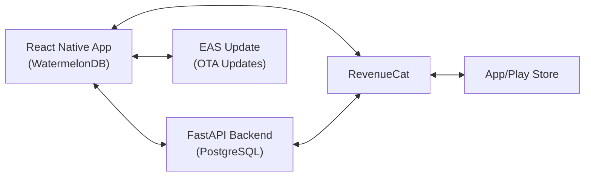

# Turn Pro Poker - Implementation Plan

> **Status as of Feb 15, 2026**  
> Phase 5 Batches 1–8 & UI Polish complete. Hand replayer fully functional with pot calculations, street progression, undo/redo navigation, action history with street separators, community card dealing, play animation, seat box redesign, hero feature, .txt HH sharing, card visual redesign, and compact board card picker.  
> **Next:** Remaining "coming soon" features, iOS build.

---

## Quick Status

### ✅ Completed
- Backend API (FastAPI + PostgreSQL)
- **Backend deployed to Render** (`https://turn-pro-poker-api.onrender.com`)
- Authentication (JWT)
- WatermelonDB models and sync endpoints
- Sync infrastructure (`SyncContext.tsx`, `SyncIndicator.tsx`)
- All core screens (Dashboard, Sessions, Stats, Bankroll, Hands, Settings)
- Android development build (EAS Build)
- **EAS Update configured** - Over-the-air code updates in ~30 seconds
- **In-app backend configuration** - Change API URL without rebuilds
- **Hot-reload workflow** - Edit code → push update → app updates instantly
- **RevenueCat configured** - Products, entitlements, webhook all set
- **Paywall UI redesigned** - Turn Pro logo, styled container, instant loading
- **CSV export** via native share sheet (`services/export.ts`)
- **Session form UX** - native date picker, location dropdown, game type toggle
- **Swipe gestures** on session cards (delete right, edit left)
- **Location management** hook (`hooks/useLocations.ts`)
- **Dashboard filters** - FilterChips (week/month/3mo/year/all + venue)
- **BankrollChart** - multi-series (Won + Net Profit), x-axis toggle, tooltips
- **BankrollModal** - deposit/withdraw forms, navigate to transactions
- **Transactions page** - full CRUD (add/edit/delete), privacy-aware
- **Global Privacy Mode** - `PrivacyContext` used in dashboard, transactions, BankrollModal
- **Passcode Lock** - 4-digit setup, auto-lock on background, verify on resume
- **SessionModalContext** - shared add/edit session modal state
- **More page** - profile card, features menu, settings, premium upgrade banner
- **GlassCard** with BlurView across 7 screens
- **ScreenWrapper** - consistent layout component
- **Theme system** (COLORS, GRADIENTS, FONTS)
- **Hands replayer UI** - 9-seat table, card/suit picker, action buttons/history
- **Hands replayer enhancements** - dealer button per-seat (from index.html), bet chip pills, SB/BB blind posting, UTG-first preflop ordering
- **Hands replayer logic** - pot calculations (stack restrictions, all-in side pots), street closing (check-around detection, aggressor tracking), community card dealing flow (auto-open board modal, waitingForBoard action gating)
- **Hands replayer navigation** - undo/redo with full state snapshots (cross-street restore of community cards, waitingForBoard), New Hand quick reset button (top-right corner)
- **Hands replayer UX** - action history street separators (PREFLOP/FLOP/TURN/RIVER dividers), unknown card (?) in card picker, bet sizing modal with stack restrictions
- **Hands replayer multi-pot** - multi-pot display (Main + Side), excess return for single-eligible pots, HU all-in fix (no false side pots)
- **Hands replayer all-in** - corrected allPlayersAllIn threshold (active===0), disabled button layout (3 grayed-out buttons), auto-advance streets when all-in
- **Hands replayer preflop** - BB option fix (lastAggressor set to UTG, not BB), active player glow indicator (red border/shadow)
- **Persistent login** - token only deleted on 401, not on network/timeout errors
- **Seat modal fix** - localStack syncs with stack prop via useEffect when modal reopens
- **Toast notification system** - replaced ~25 Alert.alert calls with dismissible toasts
- **Error boundary** - class-based boundary wrapping app provider tree
- **Skeleton loaders** - dashboard, stats, bankroll screens
- **Privacy mode enhanced** - hides chart, grays values, hides trend arrow on dashboard + stats
- **Chart fixes** - proper negative value support, zero-line indicator, clean y-axis labels, toggle repositioned
- **Session modal** - KeyboardAvoidingView prevents keyboard overlap
- **Header cleanup** - removed user avatar, filter chips + Get Coach span full width
- **Tab navigator** - `lazy={false}` eliminates first-navigation flash
- **Stats page filters** - FilterChips (time-range + venue), PrivacyContext, skeleton loader, pull-to-refresh
- **Safe-edit workflow** - git commit before/after edits, backup copies, `.agent/workflows/safe-edit.md`
- **Seat box redesign** — horizontal `[BU | 1,000]` info box, `[+]` button, BTN→BU display rename
- **Hero feature** — green glow designation, "Hero" name in HH export, one hero at a time
- **Play animation** — auto-replay at 800ms intervals, pause/resume, rewind to initial state
- **HH export** — PokerStars format, PT4-compatible, `dn()` display name helper, rake support
- **HH .txt file sharing** — SDK 54 File API, share sheet integration
- **Board card picker redesign** — compact 2×7 rank grid, tappable community card header, slot navigation
- **Card visual redesign** — gradient backgrounds (expo-linear-gradient), crisp dark suit colors, white suit icons, big center rank
- **Game logic fixes** — advanceSeat stale closure fix, spurious side pot guard, non-destructive handleHero, frozen seat ref
- **Editing rules workflow** — `.agent/workflows/editing-rules.md` (NUCLEAR BLOCK)
- Basic tests (5/11 passing — 6 pre-existing failures, see Verification Plan below for details)

### ⏳ Blocked (LOW PRIORITY)
- Real purchase testing (needs Google Play Console — deliberately deferred)

### ⏳ Upcoming
- Remaining "coming soon" items (Player Profiles, Locations, Notepad, Calendar, PDF Export)
- iOS build
- Comprehensive testing
- App Store submission

---

## Architecture



**Tech Stack:**
- Mobile: React Native + Expo + WatermelonDB
- Backend: FastAPI + PostgreSQL + JWT
- Payments: RevenueCat
- Hosting: Render.com
- Updates: EAS Update (over-the-air)

---

## Current Priority: Feature Completion & iOS Build (Phases 5–6)

**Dashboard ✅ Done:** Filters, BankrollChart, BankrollModal, privacy toggle, stat cards.  
**Stats ✅ Done:** FilterChips, PrivacyContext, skeleton loader, chart, pull-to-refresh.  
**UI Polish ✅ Done:** Toasts, error boundary, skeletons, header cleanup, tab lazy loading.

**Hands Replayer ✅ Done:** Full game logic — pot calculations with stack restrictions, street closing with check-around detection, community card dealing (auto-modal, waitingForBoard gating), undo/redo navigation with cross-street state snapshots, action history with street separators, unknown card picker, New Hand reset button, play animation (800ms auto-replay), seat box redesign (horizontal info box + `[+]` button), hero designation (green glow), .txt file sharing, compact board card picker (2×7 grid with tappable header), card visual redesign (gradient backgrounds, crisp dark colors, white suit icons).

**Next Steps:**
1. Build out "coming soon" features (Locations, Calendar, Player Profiles, Notepad, PDF Export)
2. iOS build + TestFlight testing
3. Fix pre-existing test failures, increase coverage

**ETA:** 2-3 weeks

---

## Development Workflow (NEW!)

### Instant Code Updates (30 seconds)
```bash
# Make code changes, then:
cd frontend
npx eas-cli update --branch preview --message "Your changes"
# Close/reopen app → Changes appear!
```

### Change Backend URL (No coding)
- Tap ⚙️ gear icon on login screen
- Select backend (Production/Local/Custom)
- Restart app
- Done!

### When to Rebuild APK
- ❌ **NOT needed for:** Code changes, UI updates, logic changes, API URLs
- ✅ **Only needed for:** New native dependencies, permissions changes, Expo SDK updates

---

## Timeline to Launch

| Phase | Est. Duration | Status |
|-------|--------------|---------|
| Backend Deployment | 2-3 days | ✅ Complete |
| Server Sync | 3-5 days | ✅ Complete |
| Hot-Reload Setup | 1 day | ✅ Complete |
| RevenueCat Setup | 3-4 days | ⏳ Blocked (Play Console) |
| Feature Batch 1 (Core UX) | 2 days | ✅ Complete |
| Feature Batch 2 (Dashboard/Privacy) | 3 days | ✅ Complete |
| Feature Batch 3 (UI Polish) | 2 days | ✅ Complete |
| Feature Batch 4 (Replayer Enhancements) | 2 days | ✅ Complete |
| Feature Batch 5 (Replayer Game Logic) | 3 days | ✅ Complete |
| Feature Batch 6 (Multi-pot/Auth) | 2 days | ✅ Complete |
| Feature Batch 7 (Seat Box/Hero) | 1 day | ✅ Complete |
| "Coming soon" features | 1-2 weeks | ⏳ Next |
| iOS Build | 2-3 days | 🔜 Soon |
| RevenueCat Testing | 3-4 days | ⏳ LOW PRIORITY |
| Testing & QA | 1 week | 🔜 Soon |
| Store Submission | 1 week | 🔜 Soon |

**Total: 3-5 weeks remaining** (Batches 1-7 complete!)

---

## Technology Decisions

> [!NOTE]
> **Development Workflow:**
> - ✅ EAS Update for over-the-air updates (COMPLETE)
> - ✅ In-app backend configuration (COMPLETE)
> - ✅ SecureStore for settings persistence (COMPLETE)

> [!IMPORTANT]
> **Technology Decisions:**
> - ✅ WatermelonDB for offline-first (APPROVED - implemented)
> - ✅ RevenueCat for IAP (APPROVED - SDK integrated)
> - ✅ Expo Development Build (APPROVED - Android working)
> - ✅ EAS Update (APPROVED - configured and tested)

> [!WARNING]  
> **Breaking Changes:**
> - ✅ Expo Go replaced with development builds (COMPLETE)
> - ✅ Removed react-native-dotenv (replaced with SecureStore)
> - ⚠️ Requires Xcode for iOS builds (upcoming)

---

## Verification Plan

### Backend Tests
```bash
cd backend && pytest --cov=app
# Current: ~60% | Target: >80%
```

### Frontend Tests
```bash
cd frontend && npm test -- --coverage
# Current: 5/11 passing (6 pre-existing failures)
```

**Test Suites (2 files):**

| Suite | File | Tests | Pass | Fail | Root Cause |
|-------|------|-------|------|------|------------|
| Session Financial Logic | `__tests__/financial.test.ts` | 5 | 2 | 3 | Mock `Model` class missing `_setRaw`/`_getRaw`. `Object.assign` triggers WatermelonDB setters which call `_setRaw()` → `TypeError`. |
| Sync Adapter | `__tests__/sync.test.ts` | 6 | 3 | 3 | Mock API doesn't return expected data shape for some tests; `capturedConfig` timing issues. |

> **Verdict:** These are **mock/test infrastructure issues**, not app bugs. The app works correctly. Fix during Phase 6 (Testing & QA) by rewriting mocks to properly simulate WatermelonDB internals. **LOW PRIORITY.**

### Manual Testing
- [x] Offline session creation works
- [x] WatermelonDB queries functional
- [x] Auth flow (register/login) works
- [x] Server sync working with Render
- [x] **EAS Update working** (code updates in ~30 sec)
- [x] **In-app backend switching** works
- [x] **RevenueCat SDK configured** (products, entitlements, webhook)
- [x] **Paywall UI redesigned** (logo, instant load, styled containers)
- [ ] Real purchases (pending Play Console)
- [ ] iOS build (pending)

---

## Key Files

**Backend:**
- `backend/app/api/v1/endpoints/sync.py` - Sync endpoints ✅
- `backend/app/api/v1/endpoints/auth.py` - Authentication ✅
- `backend/app/api/v1/endpoints/webhooks.py` - RevenueCat handler ⏳

**Frontend:**
- `frontend/model/Session.ts` - WatermelonDB Session model ✅
- `frontend/sync/index.ts` - Sync adapter ✅
- `frontend/services/api.ts` - API client with dynamic URL loading ✅
- `frontend/contexts/ApiConfigContext.tsx` - Backend URL management ✅
- `frontend/components/ApiSettingsModal.tsx` - In-app settings ✅
- `frontend/services/purchases.ts` - RevenueCat wrapper ✅
- `frontend/contexts/SubscriptionContext.tsx` - Subscription state ✅
- `frontend/app/paywall.tsx` - Paywall UI with branding ✅
- `frontend/services/export.ts` - CSV export service ✅
- `frontend/hooks/useLocations.ts` - Location management hook ✅
- `frontend/assets/images/turn-pro-logo-transparent.png` - Logo (transparent PNG)
- `frontend/app/(tabs)/` - Main screens ✅ (sessions page with swipe gestures)
- `frontend/components/replayer/PokerTable.tsx` - Poker table replayer (9-seat, dealer, chips) ✅
- `frontend/components/replayer/ActionButtons.tsx` - Fold/Check/Call/Bet/Raise (disabled during board dealing) ✅
- `frontend/components/replayer/ActionHistoryModal.tsx` - Action log with street separators ✅
- `frontend/components/replayer/ActionHistory.tsx` - ActionRecord types with street, prevState snapshots ✅
- `frontend/components/replayer/BetSizingModal.tsx` - Bet/raise sizing with stack restrictions ✅
- `frontend/components/replayer/Card.tsx` - Card renderer (gradient backgrounds, crisp dark suit colors, white suit icons, big center rank) ✅
- `frontend/components/replayer/SeatModal.tsx` - Board card picker (compact 2×7 rank grid, tappable community card header) ✅
- `.agent/workflows/safe-edit.md` - Safe code editing workflow (git-based reverts) ✅
- `.agent/workflows/editing-rules.md` - NUCLEAR BLOCK editing rules (must read before any code change) ✅

**Configuration:**
- `frontend/eas.json` - EAS Build and Update configuration ✅
- `frontend/app.json` - Expo config with EAS Update support ✅
- `frontend/babel.config.js` - Babel configuration ✅

---

## Next 3 Steps

1. **"Coming soon" features** — Player Profiles, Locations page, Calendar view, Notepad, PDF Export
2. **iOS build** — configure bundle ID, EAS build, TestFlight testing
3. **Testing & QA** — fix pre-existing test failures, increase coverage, E2E tests

**For detailed documentation, see:**
- [Next Phase.md](file:///c:/Users/USER/Desktop/Turn-Pro-Poker/Next%20Phase.md)
- [EAS Update Guide](file:///C:/Users/USER/.gemini/antigravity/brain/15fa22a1-7534-4908-bf28-23def5852d9c/eas_update_guide.md)
- [Instant Config Workflow](file:///C:/Users/USER/.gemini/antigravity/brain/15fa22a1-7534-4908-bf28-23def5852d9c/instant_config_workflow.md)
