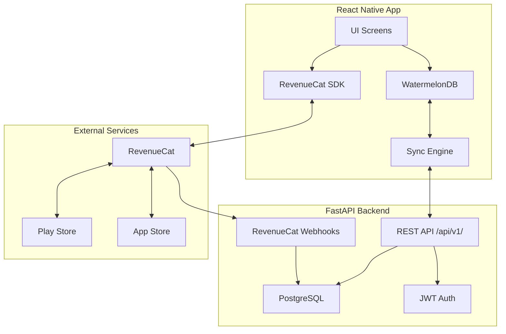

# Turn Pro Poker - Mobile App Implementation Plan

Build a production-ready React Native poker session tracking app with offline-first architecture, server sync, and in-app purchases.

## User Review Required

> [!IMPORTANT]
> **Technology Decisions Requiring Approval:**
> 1. **WatermelonDB** for offline-first local database (vs Realm, SQLite raw)
> 2. **RevenueCat** for IAP management (vs native implementations)
> 3. **Expo Development Build** approach (required for native modules)

> [!WARNING]  
> **Breaking Changes:**
> - Existing Expo Go workflow will be replaced with development builds (required for WatermelonDB & RevenueCat native modules)
> - May require Xcode/Android Studio setup on your machine for iOS/Android builds

---

## Proposed Changes

### Backend Sync & IAP Endpoints

#### [MODIFY] [deps.py](file:///c:/Users/USER/Desktop/Turn-Pro-Poker/backend/app/api/deps.py)
- Add dependency for sync validation (timestamp checking)

#### [NEW] [sync.py](file:///c:/Users/USER/Desktop/Turn-Pro-Poker/backend/app/api/v1/endpoints/sync.py)
- `POST /api/v1/sync/pull` - Pull changes since last sync timestamp
- `POST /api/v1/sync/push` - Push local changes with conflict resolution
- Implements WatermelonDB sync protocol (pull/push with `last_synced_at`)

#### [NEW] [webhooks.py](file:///c:/Users/USER/Desktop/Turn-Pro-Poker/backend/app/api/v1/endpoints/webhooks.py)
- `POST /api/v1/webhooks/revenuecat` - Handle subscription events
- Update user `subscription_tier` and `subscription_expires_at` from webhook

#### [MODIFY] [user.py](file:///c:/Users/USER/Desktop/Turn-Pro-Poker/backend/app/models/user.py)
- Add `revenuecat_app_user_id` field for IAP tracking

---

### Backend Financial Logic Tests

#### [NEW] [test_financial_calculations.py](file:///c:/Users/USER/Desktop/Turn-Pro-Poker/backend/tests/test_financial_calculations.py)
- Test `Session.profit`, `Session.hourly_rate`, `Session.bb_per_100`
- Test edge cases: zero hours, negative profit, division by zero
- Test `User.is_subscription_active()` with various expiry scenarios

#### [NEW] [test_sync.py](file:///c:/Users/USER/Desktop/Turn-Pro-Poker/backend/tests/test_sync.py)
- Test sync pull/push endpoints
- Test conflict resolution scenarios

---

### Mobile App - Offline-First Data Layer

#### [NEW] [model/schema.ts](file:///c:/Users/USER/Desktop/Turn-Pro-Poker/frontend/model/schema.ts)
- WatermelonDB schema definitions for Session, Hand, Transaction

#### [NEW] [model/Session.ts](file:///c:/Users/USER/Desktop/Turn-Pro-Poker/frontend/model/Session.ts)
- WatermelonDB Model class with computed properties (profit, hourlyRate)

#### [NEW] [sync/index.ts](file:///c:/Users/USER/Desktop/Turn-Pro-Poker/frontend/sync/index.ts)
- WatermelonDB sync adapter implementation
- Background sync with network status detection

#### [NEW] [services/api.ts](file:///c:/Users/USER/Desktop/Turn-Pro-Poker/frontend/services/api.ts)
- Typed API client with auth token management
- Offline request queue

#### [NEW] [model/Replayer.ts](file:///c:/Users/USER/Desktop/Turn-Pro-Poker/frontend/model/Replayer.ts)
- Types for Hand, Seat, Action, Card
- Replayer state management logic

---

### Mobile App - Authentication

#### [NEW] [app/(auth)/_layout.tsx](file:///c:/Users/USER/Desktop/Turn-Pro-Poker/frontend/app/(auth)/_layout.tsx)
- Auth stack layout

#### [NEW] [app/(auth)/login.tsx](file:///c:/Users/USER/Desktop/Turn-Pro-Poker/frontend/app/(auth)/login.tsx)
- Login screen with email/password

#### [NEW] [app/(auth)/register.tsx](file:///c:/Users/USER/Desktop/Turn-Pro-Poker/frontend/app/(auth)/register.tsx)
- Registration screen

#### [NEW] [contexts/AuthContext.tsx](file:///c:/Users/USER/Desktop/Turn-Pro-Poker/frontend/contexts/AuthContext.tsx)
- Auth state management, token storage, auto-refresh

---

### Mobile App - Main Screens

#### [NEW] [app/(tabs)/_layout.tsx](file:///c:/Users/USER/Desktop/Turn-Pro-Poker/frontend/app/(tabs)/_layout.tsx)
- Tab navigation: Dashboard, Sessions, Stats, Settings

#### [NEW] [app/(tabs)/dashboard.tsx](file:///c:/Users/USER/Desktop/Turn-Pro-Poker/frontend/app/(tabs)/dashboard.tsx)
- Bankroll overview, recent sessions, quick stats

#### [NEW] [app/(tabs)/sessions/index.tsx](file:///c:/Users/USER/Desktop/Turn-Pro-Poker/frontend/app/(tabs)/sessions/index.tsx)
- Session list with filtering and search

#### [NEW] [app/(tabs)/sessions/[id].tsx](file:///c:/Users/USER/Desktop/Turn-Pro-Poker/frontend/app/(tabs)/sessions/[id].tsx)
- Session detail view

#### [NEW] [app/(tabs)/sessions/new.tsx](file:///c:/Users/USER/Desktop/Turn-Pro-Poker/frontend/app/(tabs)/sessions/new.tsx)
- Create/edit session form

#### [NEW] [app/(tabs)/hand-histories/index.tsx](file:///c:/Users/USER/Desktop/Turn-Pro-Poker/frontend/app/(tabs)/hand-histories/index.tsx)
- List of saved hands
- "Add Hand" button

#### [NEW] [components/HandReplayer.tsx](file:///c:/Users/USER/Desktop/Turn-Pro-Poker/frontend/components/HandReplayer.tsx)
- Interactive poker table visualization (seats, cards, pot)
- Playback controls (next/prev action)
- Hero hole card selection modal

#### [NEW] [app/(tabs)/stats.tsx](file:///c:/Users/USER/Desktop/Turn-Pro-Poker/frontend/app/(tabs)/stats.tsx)
- Statistics dashboard with charts (BB/100, hourly rate, win rate)
- **Privacy Mode** (toggle visibility of amounts)
- Detailed breakdown: Tips, Expenses, Net vs Gross Profit

#### [NEW] [app/(tabs)/more.tsx](file:///c:/Users/USER/Desktop/Turn-Pro-Poker/frontend/app/(tabs)/more.tsx)
- Profile, subscription status, sync settings
- CSV/PDF Export options
- Location management

#### [NEW] [app/(tabs)/bankroll.tsx](file:///c:/Users/USER/Desktop/Turn-Pro-Poker/frontend/app/(tabs)/bankroll.tsx)
- Transaction history (Deposits/Withdrawals)
- Bankroll trend chart

---

### Mobile App - In-App Purchases

#### [NEW] [services/purchases.ts](file:///c:/Users/USER/Desktop/Turn-Pro-Poker/frontend/services/purchases.ts)
- RevenueCat SDK wrapper
- Entitlement checking utilities

#### [NEW] [app/paywall.tsx](file:///c:/Users/USER/Desktop/Turn-Pro-Poker/frontend/app/paywall.tsx)
- Subscription paywall screen with plan comparison

#### [NEW] [contexts/SubscriptionContext.tsx](file:///c:/Users/USER/Desktop/Turn-Pro-Poker/frontend/contexts/SubscriptionContext.tsx)
- Subscription state management, entitlement hooks

---

### Mobile App - Testing

#### [NEW] [__tests__/financial.test.ts](file:///c:/Users/USER/Desktop/Turn-Pro-Poker/frontend/__tests__/financial.test.ts)
- Unit tests for profit calculations
- Tests for edge cases (>80% coverage on financial logic)

#### [NEW] [__tests__/sync.test.ts](file:///c:/Users/USER/Desktop/Turn-Pro-Poker/frontend/__tests__/sync.test.ts)
- Sync logic tests with mocked API

---

## Verification Plan

### Automated Tests

**Backend Tests (existing + new):**
```bash
cd backend
pip install -r requirements.txt
pip install pytest pytest-asyncio pytest-cov httpx
pytest --cov=app --cov-report=term-missing
```

**Frontend Tests:**
```bash
cd frontend
npm install
npm test -- --coverage
```

**Coverage Target:** >80% on financial calculation files:
- [backend/app/models/session.py](file:///c:/Users/USER/Desktop/Turn-Pro-Poker/backend/app/models/session.py)
- `frontend/model/Session.ts`
- `frontend/__tests__/financial.test.ts`

### Manual Verification

1. **Offline-First Testing:**
   - Enable airplane mode on device
   - Create new session while offline
   - Re-enable network → verify sync completes
   - Check server has the new session

2. **IAP Testing (Sandbox):**
   - Use TestFlight (iOS) / Internal Testing (Android)
   - Complete purchase with sandbox account
   - Verify subscription tier updates in app and backend

3. **App Store Compliance:**
   - Run through Apple's App Store Review Guidelines checklist
   - Run through Google Play Store requirements checklist
   - Test restore purchases flow
   - Verify privacy policy is accessible

---

## Architecture Diagram



---

## Estimated Timeline

| Phase | Duration | Key Deliverables |
|-------|----------|------------------|
| Backend Sync & IAP | 2-3 days | Sync endpoints, webhooks, tests |
| Mobile Data Layer | 3-4 days | WatermelonDB, sync, API client |
| Authentication | 1-2 days | Login/register flows |
| Main Screens | 4-5 days | Dashboard, sessions, stats |
| In-App Purchases | 2-3 days | RevenueCat, paywall |
| Testing & Polish | 3-4 days | Tests, bug fixes, optimization |
| Store Prep | 2-3 days | Assets, descriptions, submission |

**Total:** ~3-4 weeks for full implementation
